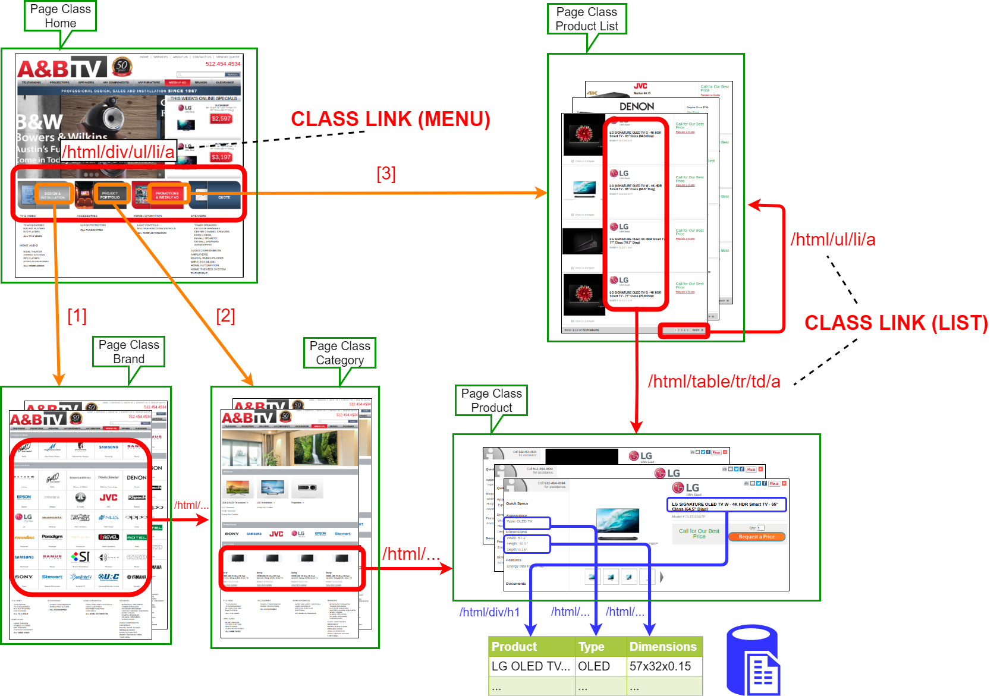
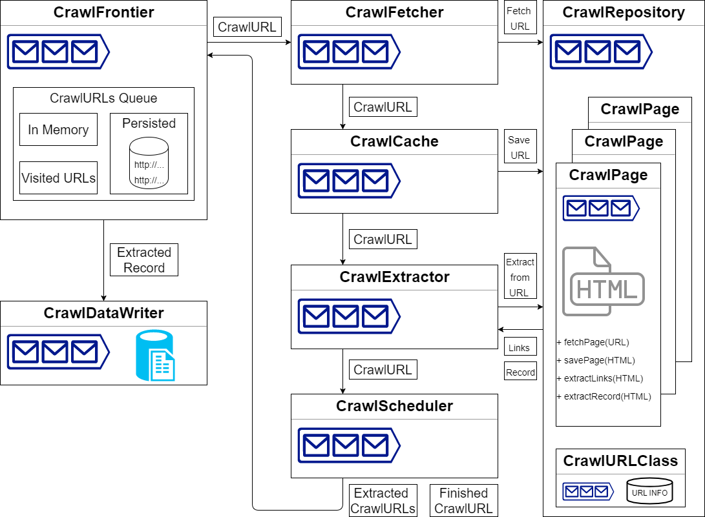

# Smart crawler of structured websites

 

A smart distributed crawler that infers navigation models of structured websites.

The crawling process is made up of in 2 phases:

1. Given a list of entrypoints (homepage URLs), the navigation model of each website is automatically inferred by exploring a limited, yet representative, sample of theirs HTML pages. 
The generated models divide each website in classes of similarly structured pages, called *Page Classes*, and describe the properties of links between different Page Classes.
2. The so generated models are then used to perform an extensive crawling of the websites, so that each URL 
can be associated with the Page Class it belongs to: the output consists of webpages clustered according to their HTML structure.

## Use Cases

Navigation models and clustered pages can be both useful for different use cases.

* The pages crawled in Phase 1, used to infer the model, can be used as samples to generate a wrapper to extract structured data from Page Classes of interest.
* Inferred models can be used in Phase 2 to explore only a portion of a website containing data of interest, rather than all the URLs. This is done by following only the links that will take the crawler to the pages of specific Page Class. For example, if you want to crawl an e-commerce website but you are interested only to the pages showing a product, then you can follow just the paths leading to the "Product" Page Class.
* Since at the end of Phase 2 structurally similar pages are clustered together, it is possible to improve the compression of large archives of HTML pages by extracting the common template code of pages within the same class.
* Inferred models can be re-generated over time, in order to identify the Page Classes that are more likely to be frequently updated by comparing different versions of the model of the same website. This is useful in case of an incremental crawling scenario where one wants to periodically re-crawl a website, avoiding the download of pages that have not changed their content since the last visit.
* Users can also skip phase 1 and write partial navigation models by hand, using XPath rules, that can be used to both 
specify how to navigate the input websites (navigation rules that match links in a page) and how to extract data of interest (extraction rules that match data in a page). An example of navigation models with navigation and extraction rules can be found [HERE](docs/form_actions_target_example.csv).

### Example of a navigation model of an e-commerce website

## Crawler Architecture
This project has been developed with the actor model framework [Akka](https://akka.io). Here is a summary of the second phase crawler architecture showing the main components and messages.

## Installation
You'll need JRE 1.8 or higher, maven and neo4j
1. Clone the project
2. Import it as a Maven Project in Eclipse or similar IDE
3. Run a Neo4J instance and provide your configuration in [ogm.properties](./src/main/resources/ogm.properties)

## Usage
1. Edit [master.conf](./src/main/resources/master.conf) with your configuration (you can find some explanation on how to set the crawler in the file itself).
2. Start slave nodes, if any, running [RepositoryMain.java](./src/main/java/it/uniroma3/crawler/RepositoryMain.java) on each node with a progressive node number as argument.
3. Run [MasterMain.java](./src/main/java/it/uniroma3/crawler/MasterMain.java) on the master node.

## Output
* Inferred models are stored in [targets](./src/main/resources/targets).
* Every dowloaded HTML page is stored in "html" directory in the root of the project.
* For each website, a CSV file of triples "URL|PAGE CLASS|LOCAL FILE PATH" is stored in [repository](./src/main/resources/repository).

## TODO
* Fix frontier limit
* Fix regex for homepage URL
* Create an option for images' download
* Check and document master.conf configurations
* Better check and document tests

## Acknowledgments
Huge thanks to [Fabio Cibecchini](https://github.com/fcibecchini) for starting this project!
